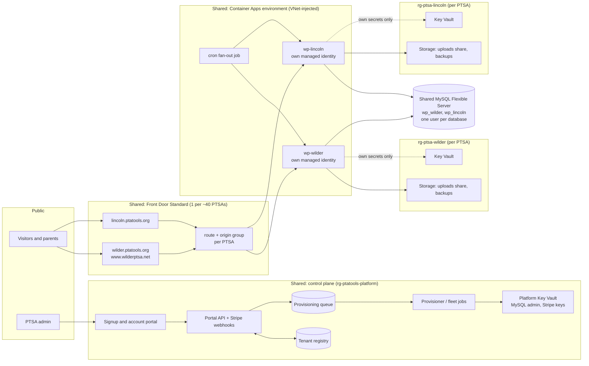

# PTA Tools Cloud: a hosted, pay-monthly platform for PTSAs

**Status:** proposal, not built
**Date:** 2026-09-24
**Cost model:** [`cost_model.py`](cost_model.py). Every price quoted below comes
from it, and it can be re-run with different assumptions.

## Summary

Today, a PTSA that wants PTA Tools has to set up the whole Azure stack itself
before it can install the plugin. That means Container Apps, MySQL, Front Door,
Key Vault, storage and an Entra app registration. The proposal is to run one
shared platform where a PTSA signs up, pays, and gets its own WordPress site
within minutes, with PTA Tools already installed and its logo and colours
applied.

Each PTSA gets its **own container, database, database user, storage account,
Key Vault and managed identity**. Only things that carry no customer data are
shared: the Container Apps environment, the MySQL *server*, Front Door, the
image registry and the control plane. A compromised site can reach only its own
secrets, files and tables, because every credential it holds is scoped to that
PTSA's resources.

At retail pay-as-you-go prices, with no grant applied:

| PTSAs on the platform | Starter, cost per PTSA per month | Standard, cost per PTSA per month |
| ---: | ---: | ---: |
| 1 | $71.53 | $84.46 |
| 10 | $16.95 | $29.88 |
| 25 | $12.81 | $25.75 |
| 100 | $12.01 | $24.95 |

For comparison, wilderptsa.net on its own costs about $83/month
(`docs/runbooks/container-migration-2026-07.md`), and the minimum any single
self-hosted PTSA can reach is about $65/month, because Front Door's $35 base
fee and a database server are fixed costs.

Most of the saving arrives by **about 25 PTSAs**. After that the cost per PTSA
is almost flat, because it is dominated by each PTSA's own container memory,
not by shared infrastructure.

Recommended prices, billed once a year by bank transfer (ACH) so card fees
stay small:

- **Starter: $180/year** (equivalent to $15/month): 0.25 vCPU, 0.5 GiB, 5 GB
  media, scales to zero overnight and in summer.
- **Standard: $330/year** (equivalent to $27.50/month): 0.5 vCPU, 1 GiB, 10 GB
  media, always on during the school year. This is the size wilderptsa.net
  runs today.
- Monthly card billing adds $2/month to cover Stripe's fixed 30¢ fee.

These prices cover costs with a small reserve from about 25 PTSAs onward.
Below that, fixed costs of $100–150/month are not fully covered. That is less
than Wilder alone spends on Azure today, so moving Wilder onto the platform as
its first tenant pays for the shared base from day one.

---

## 1. Where things stand

### What a new PTSA has to do today

1. Create an Azure subscription, ideally with the $2,000/year nonprofit grant.
2. Stand up MySQL Flexible Server in a VNet with private DNS, a Container Apps
   environment in a delegated subnet, a registry, a storage share, Key Vault,
   a managed identity with role assignments, Front Door with a custom domain,
   and a cron job. See `infra/aca-wordpress/`.
3. Build the image (`infra/wp-image/build.sh`) and work through the traps in
   `docs/runbooks/container-migration-2026-07.md`: TLS to MySQL, `siteurl`, the
   Front Door `Host` rewrite, permalinks, and so on.
4. Create an Entra app registration and paste IDs and secrets into the setup
   wizard.

Only someone who already runs Azure can do this. It also means every PTSA pays
the fixed base costs separately.

### What can be reused

- **The image model is ready to share.** `infra/wp-image/Dockerfile` builds an
  immutable image with WordPress core, the theme and every plugin baked in.
  Only `uploads` persists. Every PTSA can run the same image.
- **The plugin is already generic.** No plugin PHP mentions Wilder. The
  setup wizard (`class-setup-wizard.php`) already collects organisation info,
  modules and credentials. Modules switch on and off individually.
- **Edge caching is correct for any tenant.** `Azure_Edge_Cache` decides
  cacheability at the origin, and the header hydrates on the client. That is
  why each container can stay small.
- **Key Vault references and managed-identity image pulls** are already how
  `wilderptsa-wp` gets its secrets (`containerapp-prod.yaml`).

### What has to change

- `WORDPRESS_CONFIG_EXTRA` in `containerapp-prod.yaml` hard-codes
  `wilderptsa.net`, the Front Door ID, the Redis host and the cache salt. These
  must become per-tenant environment variables.
- Plugin credentials (`common_client_secret` and the per-module secrets in
  `class-settings.php`) are stored in `wp_options`, so every database dump and
  backup contains them. On the platform they should come from the tenant's Key
  Vault as environment variables.
- **Redis cannot be the shared cache.** New Azure Cache for Redis instances are
  blocked for new customers from 2026-04-01, and the service retires on
  2028-09-30. The replacement, Azure Managed Redis, has no numbered databases
  in clustered mode. A shared cache would separate tenants only by key prefix,
  and any tenant holding the password could read every key. That is the same
  weakness `docs/runbooks/redis-isolation.md` had to work around between
  slots. Use an in-process APCu object cache instead: it costs nothing and
  gives complete isolation.
- `Azure_Platform_Sync` (the staging-slot Danger Zone), the GitHub self-updater
  and the Front Door purge-by-managed-identity all assume a tenant owns its own
  Azure resources. They must be hidden or routed through the platform.

---

## 2. Options considered

| Option | Cost per PTSA at 25 PTSAs | Isolation | Verdict |
| --- | --- | --- | --- |
| Each PTSA self-hosts (today) | about $65–85 | Complete, separate subscriptions | Too expensive and too hard to set up |
| **One container app per PTSA on shared Container Apps** | **$13–26** | Separate identity, vault, database, storage and process; shared server, environment and edge | **Recommended** |
| One AKS cluster, one pod per PTSA | about $8–15 | Same as above if Entra workload identity is used per pod | Cheaper past ~75 PTSAs, but running Kubernetes is too much operational work for volunteers. Revisit later (phase 5). |
| WordPress Multisite, one install for all | under $3 | **None.** Every site shares `wp_users`, the database and the PHP process | Rejected: a single bug or plugin can leak one PTSA's members to another |
| One VM running Docker | about $5 | Weak, since all containers share one VM identity | Rejected: single point of failure, manual patching, no per-tenant identity |

### Why Container Apps Consumption, not Dedicated profiles

Consumption charges the **idle** rate ($0.000004 per vCPU-second) whenever a
replica is doing nothing, and that is true of a PTSA site most of the day.
0.5 vCPU / 1 GiB costs about $15.80/month when idle. The same slice of a
Dedicated D4 node costs about $34, plus a $73/month management fee per
environment. Dedicated only wins with far more tenants packed per node than
Container Apps lets you over-commit.

---

## 3. Economics

### Where the money goes

Output of `python3 docs/hosted-platform/cost_model.py`:

```
Per-tenant variable cost, USD / month (annualised over 12 months)

Tier        Compute  Storage   Edge  Other   Total
Starter        5.24     0.36   0.53   0.61    6.75
Standard      16.42     0.71   1.59   0.96   19.68

Fully loaded cost per tenant as the platform grows, USD / month

 PTSAs  MySQL        AFD   Fixed Fixed/PTSA  Starter  Standard
     1  1 x B1ms      35      65      64.78    71.53     84.46
     5  1 x B2s       35     102      20.40    27.15     40.08
    10  1 x B2s       35     102      10.20    16.95     29.88
    25  1 x B2ms      35     152       6.07    12.81     25.75
    40  2 x B2ms      35     253       6.33    13.08     26.01
    75  3 x B2ms      70     390       5.20    11.95     24.88
   100  4 x B2ms     105     526       5.26    12.01     24.95
   200  7 x B2ms     175     901       4.51    11.25     24.19

Stripe overhead on the price charged, USD / month equivalent

  $15/mo  card monthly 0.84   ACH annual 0.23
  $25/mo  card monthly 1.20   ACH annual 0.38
```

Retail unit prices used (westus2 / Front Door Zone 1, 2026-09-24):

| Meter | Price |
| --- | --- |
| Container Apps vCPU, idle / active | $0.000004 / $0.000034 per second |
| Container Apps memory | $0.000004 per GiB-second |
| MySQL Flexible B1ms / B2s / B2ms | $0.017 / $0.068 / $0.136 per hour |
| MySQL storage | $0.115 per GB-month; backups free up to provisioned size |
| Front Door Standard base | $35 per profile per month |
| Front Door requests / egress / origin-to-edge | $0.009 per 10K / $0.0825 per GB / $0.02 per GB |
| Azure Files Standard LRS | $0.06 per GB-month |
| Blob Cool LRS | $0.01 per GB-month |
| Key Vault Standard | $0.03 per 10K operations; no per-vault charge |
| ACR Basic | $5.07 per month |
| Log Analytics | $2.30 per GB after the free 5 GB |
| ACS Email | $0.00025 per email + $0.00012 per MB |

### What drives each line

- **Container memory is the largest cost.** The Consumption memory rate is the
  same whether the replica is busy or idle, so 1 GiB always costs about
  $10.50/month while it is running. That is why the Starter tier uses 0.5 GiB
  and scales to zero overnight and in summer. It is also why the Standard tier
  should not start larger than wilderptsa.net's measured 0.5 vCPU / 1 GiB.
- **The shared MySQL server is the largest fixed cost.** Sizing assumes about
  0.05 vCPU and 150 MB of buffer pool per PTSA. Wilder, a busy WooCommerce
  PTSA, used 0.07 vCPU on the old server. Add a B2ms server for every ~30
  PTSAs instead of growing one server, which also limits how many PTSAs one
  database incident can affect.
- **Front Door is cheap once shared.** A Standard profile allows 100 custom
  domains and 100 origin groups. At 2–3 domains per PTSA that is about 40 PTSAs
  per profile, or under $1 each. Premium ($330/month) is never worth it here.
- **Summer matters.** Parking every site for July and August, scaled to zero
  and woken by HTTP, removes about a sixth of annual compute. The
  `summer-2026-*` runbooks show there is already appetite for this.
- **Front Door health probes must be off.** With one origin per origin group,
  probes do nothing useful. They send requests from every edge location, which
  would keep each container in the *active* billing state around the clock.
  Microsoft's guidance is to disable probes for single-origin groups.

### Payments

- Stripe charges 2.9% + 30¢ per card payment, plus 0.7% for Stripe Billing
  subscriptions. On a $15/month card charge that is 84¢, or 6%.
- Stripe ACH Direct Debit is 0.8%, capped at $5. An annual $180 ACH payment
  costs $2.70 in total including Billing, which is 23¢ a month. PTSAs budget by
  school year, so **annual ACH should be the default**.
- Stripe's nonprofit rate (2.2% + 30¢) is only for accounts whose volume is
  mostly tax-deductible donations. Subscription fees do not qualify.

### The nonprofit Azure grant

Microsoft gives eligible nonprofits $2,000 of Azure credit a year, renewed
annually, with no rollover. Two consequences:

- **For the platform:** if the operating entity is a validated nonprofit, the
  grant would cover the whole fixed base up to about 25 PTSAs ($152/month is
  about $1,824/year). The grant terms say Microsoft can suspend usage that
  violates nonprofit terms. Using donated credit to host other organisations
  for a fee needs checking with Microsoft for Nonprofits first. **The model
  assumes no grant.** Treat any grant as a reserve, not as the business model.
- **For PTSAs:** a PTSA with its own grant can already self-host for $0. The
  platform's value to them is removing the setup and maintenance work, not
  the Azure bill. The one-click "bring your own subscription" option in phase 5
  serves them.

### Break-even

At 25 PTSAs and the recommended prices, each PTSA leaves a reserve of about
$2.00/month on Starter and $1.40/month on Standard after Azure and Stripe
costs. Starter breaks even at about 20 PTSAs and Standard at about 25. Between
1 and 25 PTSAs the shortfall is at most about $65/month. That is
covered if Wilder moves across and keeps paying what it pays today, until the
tenant count catches up.

---

## 4. Target architecture



### Shared compared with per-PTSA

| Resource | Scope | Why |
| --- | --- | --- |
| Container Apps environment, VNet, private DNS | Shared | No fee on the Consumption profile. The environment is the network boundary to MySQL. |
| Container app `wp-<slug>` | **Per PTSA** | Own process, CPU and memory limits, revision history and scale rules |
| User-assigned managed identity `id-<slug>` | **Per PTSA** | The only credential the container holds. Its roles cover only this PTSA's vault and storage, plus `AcrPull`. |
| Key Vault `kv-<slug>-<suffix>` | **Per PTSA** | No per-vault charge. A separate vault is a hard RBAC boundary, stronger than secret-level permissions in one shared vault. |
| Storage account `st<slug><suffix>` | **Per PTSA** | Uploads file share with a tier quota, a backups container, clean deletion, per-PTSA cost tags |
| MySQL server | Shared (one per ~30 PTSAs) | A B1ms per PTSA would cost $15 each. Isolation comes from a separate database and user with grants on that database only. |
| MySQL database `wp_<slug>` and user `u_<slug>` | **Per PTSA** | `REQUIRE SSL`, `MAX_USER_CONNECTIONS`, no global privileges |
| Front Door profile, endpoint, rule set, WAF policy | Shared | $35 base fee per profile |
| Front Door origin group, origin, route, custom domains | **Per PTSA** | Routing, certificates and purge scope per PTSA |
| Object cache | **Per PTSA** (APCu, in process) | No shared keyspace to leak through |
| Container registry and image | Shared | Same code for everyone. Contains no tenant data or secrets. |
| Log Analytics workspace | Shared, operators only | PTSAs see their own logs through the portal API, filtered by app name. They never get workspace access. |
| Control plane: portal, API, registry, queue, jobs | Shared | Platform-owned |

---

## 5. Tenant isolation and Key Vault design

The goal is that **no credential inside a PTSA's container can read another
PTSA's data**, even if the container is fully compromised, for example by a
WordPress remote-code-execution bug.

### Identity and secrets

- Each container runs as its own user-assigned managed identity. Role
  assignments for that identity:
  - `Key Vault Secrets User` on **its own vault** only
  - `Storage Blob Data Contributor` on **its own storage account** only
  - `AcrPull` on the shared registry, which is read-only and holds only code
- Each PTSA's vault holds:
  - `db-password`: random, generated by the provisioner, never shown to anyone
  - `wp-auth-keys`: the eight WordPress salts, which invalidate sessions if
    rotated
  - `m365-client-secret`: written by the Connect Microsoft 365 flow (below)
  - Optional payment keys (Stripe or WooPayments for the PTSA's own shop) and
    an ACS connection string
- The container reads these as Container Apps Key Vault secret references,
  exactly as `wilderptsa-wp` reads `db-password` today. The plugin reads
  `PTA_M365_CLIENT_SECRET` and similar values from the environment in hosted
  mode instead of from `wp_options`, so **database dumps and backups contain
  no secrets**.
- The platform vault (`kv-ptatools-platform`) holds the MySQL admin password,
  Stripe secret and webhook keys, and storage account keys for mounts. Only the
  provisioner and fleet identities can read it. No tenant identity can.
- Vault settings: RBAC authorisation (no access policies), soft delete for
  7 days, purge protection on. Vault names carry a random suffix, so a
  cancelled PTSA's soft-deleted name never blocks a re-signup.
- Rotation: write a new secret version, then restart the revision. The fleet
  job can do this across all tenants, for example after a suspected leak of the
  MySQL admin password.

### Database

```sql
CREATE DATABASE wp_lincoln CHARACTER SET utf8mb4 COLLATE utf8mb4_unicode_520_ci;
CREATE USER 'u_lincoln'@'%' IDENTIFIED BY '<from vault>'
  REQUIRE SSL WITH MAX_USER_CONNECTIONS 40;
GRANT ALL PRIVILEGES ON wp_lincoln.* TO 'u_lincoln'@'%';
```

- No tenant user holds `PROCESS`, `SUPER`, `FILE` or any global grant, so
  `SHOW PROCESSLIST` and `information_schema` show nothing from other
  databases.
- `MAX_USER_CONNECTIONS` stops one PTSA's traffic spike from using up the
  server's connection limit (171 on B1ms, 683 on B2ms).
- Microsoft Entra authentication for MySQL, where the managed identity is the
  database user and no password exists, is a later hardening step. WordPress
  would need a `db.php` drop-in that fetches a token on each connection.
- Point-in-time restore on Flexible Server restores the **whole server** to a
  new server. Single-PTSA restores therefore come from each PTSA's own nightly
  logical dump (see section 8), not from server restore.

### Files

- Uploads live on an Azure Files share in the PTSA's own storage account,
  mounted at `wp-content/uploads`, the same as today. Container Apps SMB mounts
  need the account key. That key lives in the environment's storage definition,
  which the provisioner writes from the platform vault. The container sees only
  the mounted path, never the key.
- NFS shares are ruled out. NFS has no per-client credentials, so any container
  on the shared VNet could mount another PTSA's share.
- Later: move uploads to Blob using the managed identity and serve them through
  Front Door. That removes SMB latency and the account key altogether.

### Network and edge

- Container ingress accepts Front Door traffic only, as `wilderptsa-wp` does
  today. wp-config trusts `X-Forwarded-Host` only when `X-Azure-FDID` matches
  **and** the host is in that PTSA's own `PTA_PUBLIC_HOSTS` list. Every PTSA
  shares one Front Door ID, so the per-tenant host list is what stops tenant A's
  hostname being forged against tenant B's container.
- **Cache purges go through the platform.** Today the plugin purges with a
  custom Front Door Purge Only role at profile scope. On a shared profile, that
  role would let any PTSA purge every PTSA's cache, and Front Door has no
  role scoped narrower than the endpoint. In hosted mode the plugin calls
  `POST /api/tenants/{id}/purge` with its managed-identity token. The API maps
  the token's identity to the tenant and purges only that tenant's domains.
  The `s-maxage=300` backstop still applies if the call fails.
- The shared WAF policy on Standard allows custom rules only. Use it for rate
  limits on `wp-login.php` and `xmlrpc.php`, and to block `/.env`-style probes.

### Microsoft 365 connection

Most modules (SSO, calendar sync, Graph email, OneDrive media, PTA roles and
groups) act inside **the PTSA's own Microsoft 365 tenant**. Two designs:

1. **One multi-tenant platform app, consented to by each PTSA.** Easiest for
   the PTSA, but every container would hold a credential that can get tokens
   for *every* consenting PTSA's tenant. That is a cross-tenant leak path, so
   this design is rejected unless all tokens go through a broker service.
2. **One app registration in each PTSA's own tenant, created automatically.**
   *Recommended.* In the portal, the PTSA's Microsoft 365 admin clicks
   Connect Microsoft 365 and signs in with delegated admin consent. The portal
   then creates the app registration in their tenant through Graph, requests
   only the application permissions for the modules they enabled, grants
   admin consent and creates a client secret. It writes the secret straight
   into that PTSA's vault and never displays it. A leaked secret can reach only
   that PTSA's own tenant.

PTSAs without Microsoft 365, such as those on Google Workspace, skip this
step. Microsoft-dependent modules stay off, and sign-in falls back to
WordPress accounts.

### Threat checklist

| If this is compromised | Blast radius | Why |
| --- | --- | --- |
| One PTSA's container (plugin RCE) | That PTSA only | Its identity reaches only its vault, storage and database |
| A PTSA admin account | That PTSA only | `DISALLOW_FILE_MODS` and `DISALLOW_FILE_EDIT` block code changes, and platform settings are hidden |
| The shared image, for example a vulnerable plugin | Every PTSA, but only per container | Same as above, multiplied. Mitigated by ring rollout, image scanning and a fast rebuild path. |
| MySQL admin password | Every database | Only in the platform vault. Usable only from inside the VNet, since the server has no public access. |
| Provisioner identity | Every tenant | Scoped by role-assignment conditions so it can grant only the three tenant roles above. Its activity alerts. |
| A Stripe webhook forgery | None | Signature verified, events handled idempotently, and tenant state re-read from the Stripe API before acting |

---

## 6. What the PTSA experiences

### Signing up

1. On the platform site (for example `ptatools.org`), the PTSA chooses Starter
   or Standard and enters the PTSA name, school, a subdomain slug, the admin
   email, timezone, and optionally a logo and brand colours.
2. Stripe Checkout takes the payment. Annual ACH is the default, and a card
   is the alternative.
3. The next screen shows "Setting up your site…" with live steps. About 5–10
   minutes later the admin gets a welcome email with a set-password link. The
   site works at `https://<slug>.ptatools.org` immediately.

### The account portal

The portal is for things outside WordPress:

- Plan, invoices, payment method and cancellation, all through the Stripe
  Customer Portal
- **Branding**: upload a logo, site icon and header image, and pick colours.
  Uploads are limited to images and size, and are **re-encoded on the server**
  so no embedded payload reaches the site. They are then pushed into WordPress
  as media, `custom_logo`, `site_icon` and theme mods.
- Custom domain: add `www.myptsa.org`, see the exact TXT and CNAME records to
  create at GoDaddy or Cloudflare, and watch validation complete. There is
  apex-domain guidance for registrars without CNAME flattening.
- Connect Microsoft 365 (above)
- Storage used against quota, and a backup list with "restore to yesterday"
- Export everything (database dump and uploads archive as a time-limited
  download), and delete the site

### Inside WordPress: the plugin as the customisation surface

The PTSA admin is a full WordPress administrator of **their own** site. PTA
Tools is where they customise the site:

- The setup wizard runs on first sign-in with organisation info already filled
  in from signup. The Azure credentials step is replaced by "Managed by PTA
  Tools Cloud", with a link to Connect Microsoft 365.
- Module toggles (Classes, Tickets, Newsletter, Auction, Donations, Volunteer
  Sign Up and the rest) work exactly as today. Per-site emails and class sizes
  can already be edited (see commit `5d6d41f`).
- Media library, menus, pages, the Customizer and the block editor all work
  normally. Uploads persist on the PTSA's share.
- Hidden or locked in hosted mode: Platform/Danger Zone (`Azure_Platform_Sync`),
  Front Door settings, backup storage credentials, debug file logging (logs go
  to stdout instead), the GitHub self-updater, and plugin or theme installs.
  Every plugin is part of the image, and an allow-list of optional ones can be
  switched on per PTSA.

---

## 7. What happens when a PTSA buys the service

### Events

| Stripe event | Platform action |
| --- | --- |
| `checkout.session.completed` | Create the tenant record in `Provisioning` state and queue `provision` |
| `invoice.paid` | Mark `Active`, record the paid-through date |
| `invoice.payment_failed` | `PastDue`: show a wp-admin banner and send emails. Stripe retries the payment. |
| Still unpaid after 21 days | `Parked`: scale to zero and route the domain to a static "paused" page. Data is kept. |
| `customer.subscription.deleted` or parked for 60 days | Offer an export, then `Deleted` after 30 days |

The webhook handler verifies the signature, stores the event ID for
idempotency, and re-reads the subscription from Stripe before changing state.

### The provisioning job, step by step

A queue-triggered Container Apps job runs as the platform provisioner
identity. Every step checks whether its result already exists, so a retry
resumes where the last attempt stopped.

1. **Choose placement.** Pick the MySQL server and Front Door profile with
   spare capacity from the registry. Create a new server or profile when the
   last one is full.
2. **Create `rg-ptsa-<slug>`**, tagged with tenant ID, tier and Stripe customer
   ID, so Cost Management reports cost per PTSA.
3. **Deploy `tenant.bicep`** into that resource group: the managed identity,
   the Key Vault, and the storage account with an uploads share (quota by tier)
   and a `backups` container. Also the three role assignments, plus
   `Key Vault Secrets Officer` for the provisioner on the new vault.
4. **Write the secrets**: the database password and WordPress salts, generated
   in the job and never logged.
5. **Create the database and user** with the SQL in section 5. This runs inside
   the VNet because the server is private, the same pattern as
   `job-db-sql.yaml`.
6. **Register the file share** on the environment
   (`az containerapp env storage set`), with the account key taken from the
   storage account.
7. **Create `wp-<slug>`** in the shared environment from `tenant-app.bicep`:
   the current ring's image, Key Vault secret references, and environment
   variables `PTA_HOSTED=1`, `PTA_TENANT_ID`, `PTA_PUBLIC_HOSTS`,
   `PTA_AFD_ID`, `WP_CACHE_KEY_SALT` and the database host, name and user.
   Also the tier's CPU and memory, and scale rules: a KEDA cron scaler for
   overnight scale-down, and HTTP wake with minimum 0 for Starter.
8. **Install WordPress** in a one-off job that uses the tenant's own identity
   and secrets:
   - `wp core install` with a random admin password, since the admin sets their
     own through the welcome link
   - Activate PTA Tools and the tier's default modules
   - Set permalinks to `/%postname%/`
   - Create starter pages from `Azure_PTSA_Page_Templates`
   - Import the logo and set `custom_logo`, `site_icon` and colours
   - Pre-fill the wizard's organisation settings
9. **Wire up Front Door**:
   - Origin group `og-<slug>` with health probes disabled
   - An origin whose host header is the app's FQDN, as today
   - Custom domain `<slug>.ptatools.org` with a managed certificate. The
     validation TXT record and the CNAME go into the platform's own Azure DNS
     zone automatically.
   - Route `rt-<slug>` using the shared cache-bypass rule set
10. **Smoke test.** Check `/healthz` at the origin. Then check the public URL
    for a 200, `x-cache` behaviour and a working `/wp-login.php`. This is the
    same check as `infra/post-change-smoke.sh`.
11. **Mark the tenant `Active`** and send the welcome email.

Front Door managed certificates don't support wildcard domains, which is why
each subdomain is added as its own custom domain. Because the platform owns
the DNS zone, this is fully automatic. Managed certificate issuance usually
takes minutes but can take longer. The status page shows the origin-backed
preview until it finishes.

If a step fails three times, the tenant moves to `ProvisioningFailed` and an
operator is alerted. The customer sees a holding message. Payment is not
refunded automatically.

### Custom domains afterwards

When a PTSA adds `www.myptsa.org`, the platform:

1. Creates the Front Door custom domain and shows the TXT and CNAME records.
2. Polls until validation succeeds and the certificate is issued.
3. Attaches the domain to the tenant's route.
4. Adds the host to `PTA_PUBLIC_HOSTS`, which creates a new revision.
5. Runs `wp search-replace`, the same job as `job-url-rewrite.yaml`, to move
   the canonical URL.

The platform subdomain keeps working and redirects to the new domain.

### Deletion

The job removes, in this order:

1. The Front Door route, custom domains and origin group
2. The container app and its storage definition
3. `DROP DATABASE` and `DROP USER`
4. The resource group. The vault becomes soft-deleted and is purged when
   retention ends.

It then records a deletion receipt in the registry with a timestamp and the
resource IDs.

---

## 8. Running the fleet

- **One image, rolled out in rings.** The existing `release-beta.yml` and
  `release-production.yml` workflows build `ptatools-wp:<version>`, scan it
  with Trivy and push it to ACR. The fleet job then rolls it out:
  - Ring 0 is a platform demo tenant
  - Ring 1 is Wilder plus volunteer early adopters
  - Ring 2 is everyone else

  For each tenant it updates the image, runs `wp core update-db` and any
  plugin migrations as a job, and runs the smoke test. It stops the ring on the
  first failure and redeploys the previous tag. New images must still run
  against the previous schema until migration finishes.
- **Cron.** A single fan-out job every 10 minutes calls each active tenant's
  `wp-cron.php` directly at the container, the same way `job-wpcron.yaml` does
  today. That is one resource instead of one job per PTSA.
- **Backups.** Each PTSA's plugin Backup module is locked to its own storage
  account through the managed identity. A nightly logical database dump and a
  weekly uploads snapshot go to that account's Cool-tier `backups` container,
  kept for 30 days. Server-level point-in-time restore (7 days) covers
  disasters. The restore procedure is tested per tenant, as
  `docs/runbooks/backup-verification-2026-07-13.md` did for Wilder.
- **Monitoring.** One Log Analytics workspace with a daily ingestion cap.
  Apache access logs are off in the container, because Front Door logs cover
  them. A platform health-checker job hits every tenant's `/healthz` and
  public URL every 5 minutes. That is far cheaper than a multi-region
  availability test per tenant. Alerts cover a failing tenant, MySQL CPU
  credits, connection counts and Front Door 5xx rates.
- **Support access.** Operators have no standing admin account on tenant
  sites. A support session creates a time-limited WordPress admin user through
  WP-CLI after the PTSA approves it in the portal, and deletes it afterwards.
  Both steps are logged.
- **Capacity.** The registry tracks tenants per MySQL server, per Front Door
  profile and per environment. Check the environment's Consumption core quota
  with `az containerapp env list-usages` and request an increase before it
  binds. Add a second environment when needed. Apps can use any environment
  in the region, because the tenant resource group does not need to match.

---

## 9. Changes to this repository

### Plugin (`Azure Plugin/`)

- A hosted-mode switch, `PTA_HOSTED` from the environment, that:
  - hides `Azure_Platform_Sync`, the Front Door settings, backup storage
    credentials, the GitHub self-updater and debug file logging
  - replaces the wizard's Azure step with "Managed by PTA Tools Cloud"
  - shows plan, storage used and portal links on the dashboard
- Credential resolution in `Azure_Settings::get_credentials()`: prefer
  environment variables (`PTA_M365_TENANT_ID`, `PTA_M365_CLIENT_ID`,
  `PTA_M365_CLIENT_SECRET`) over `wp_options` when hosted.
- `Azure_Edge_Cache` purge: call the platform purge API when hosted, and keep
  the managed-identity path for self-hosted sites.
- An upload quota check in `wp_handle_upload_prefilter` against
  `PTA_MEDIA_QUOTA_MB`.
- Backup module: when hosted, the destination is fixed to the tenant's own
  storage account through the managed identity.

### Image (`infra/wp-image/`)

- Add APCu and an APCu object-cache drop-in in place of the Redis drop-in,
  with Redis kept optional for self-hosted sites.
- Move the logic in `WORDPRESS_CONFIG_EXTRA` into a baked
  `wp-config-hosted.php`, driven by environment variables:
  - public hosts
  - Front Door ID
  - cache salt
  - `DISALLOW_FILE_MODS` when hosted
- Bake in a default block theme with style variations, so the portal's logo and
  colours apply without theme-specific code.

### Infrastructure (new `infra/platform/`)

- `platform.bicep`: environment, VNet, MySQL server(s), Front Door profile and
  rule set, ACR, platform vault, registry storage, queue and control-plane apps
- `tenant.bicep` and `tenant-app.bicep`: the per-PTSA resources from section 7
- Provisioner, fleet, cron fan-out, backup and health-checker job definitions

### Control plane (new `platform/`)

- Portal front end: Static Web Apps Free
- Portal API and webhooks: a small Container App scaled to zero, or Functions
  Flex Consumption. Either stays inside free grants at this scale.
- Tenant registry: Azure Table Storage, costing pennies
- Portal sign-in: Microsoft Entra External ID (free up to 50,000 monthly
  users), with Microsoft and Google sign-in

---

## 10. Delivery phases

Each phase ends with something usable, and later phases don't block earlier
ones.

1. **Make the image tenant-neutral.** Hosted mode, credentials from the
   environment, APCu cache, config from environment variables. *Exit
   criterion:* wilderptsa.net runs the new image with its settings in
   environment variables and no Redis.
2. **Scripted tenant provisioning, run by hand.** `platform.bicep`,
   `tenant.bicep` and the provisioner job, triggered from the CLI. *Exit
   criterion:* two test PTSAs are created and deleted end to end, and a
   cross-tenant test fails as expected. That test uses tenant A's identity
   token against tenant B's vault, storage and database, and must be denied in
   every case.
3. **Move Wilder onto the platform** as tenant #1, using the migration
   runbook's database and uploads transfer. Retire the standalone
   `PTSAWebsite` stack. *Exit criterion:* Wilder's Azure bill drops, and its
   smoke test and cookie cache matrix both pass.
4. **Self-service.** Portal, Stripe, webhooks, branding upload, custom domains,
   Connect Microsoft 365, fleet rings, backups and restore, health checker.
   *Exit criterion:* a volunteer PTSA signs up with no operator involvement.
5. **Scale and options**, when the numbers justify them:
   - A second MySQL server, Front Door profile or environment
   - Blob-backed uploads
   - Entra authentication for MySQL
   - "Bring your own subscription" for PTSAs with their own nonprofit grant,
     using the same Bicep deployed into their subscription
   - An AKS density tier past about 75 Standard PTSAs

---

## 11. Risks and open decisions

- **Legal entity and liability.** Hosting other organisations' member data and
  processing their payments needs an owner: a nonprofit, or the Wilder PTSA
  with board approval. It also needs terms of service, a privacy policy
  covering children's names (the plugin stores children on parent profiles),
  and a data-processing agreement. Decide this before phase 4.
- **The nonprofit grant.** Confirm with Microsoft for Nonprofits whether
  donated credit can fund a service sold to other nonprofits. Until then,
  price as if it can't.
- **Shared image means shared risk.** One vulnerable plugin affects every PTSA
  at once. The curated plugin list, ring rollout and a rebuild path measured in
  hours are the mitigations. Keep the plugin list short.
- **PTSAs' own payment accounts.** WooCommerce and WooPayments or Stripe
  credentials belong to each PTSA and stay in its vault. The platform never
  handles their money.
- **Support load, not Azure, may be the real cost.** Price in a reserve.
  Prefer self-service (portal, restore button, docs) over operator actions.
- **Assumptions to re-measure after the first ~5 tenants:** active-time
  fraction, per-tenant MySQL load, Front Door egress, and log volume. Update
  `cost_model.py` and re-run it.
